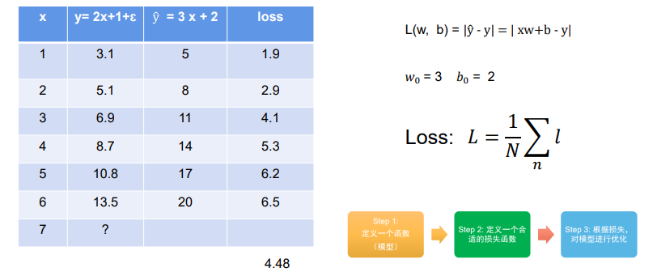

深度学习任务
    分类和回归是结构化的基础
        分类的时候是用数字来表示类别
        可能需要多模态数据：声音，图片，文字

回归与神经元
    如何开始深度学习：
    1、定义一个函数(模型)
        计算loss：
        torch框架可以帮助自动计算，优化模型
    2、定义一个合适的损失函数
    3、根据损失对模型进行优化

线性函数与多层神经元