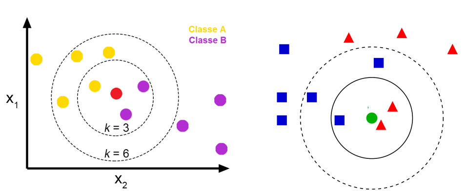
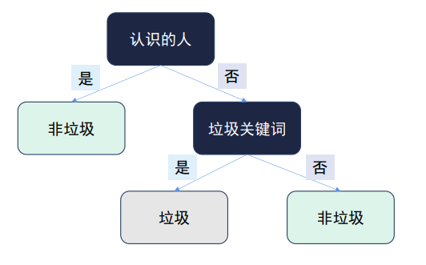
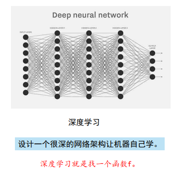
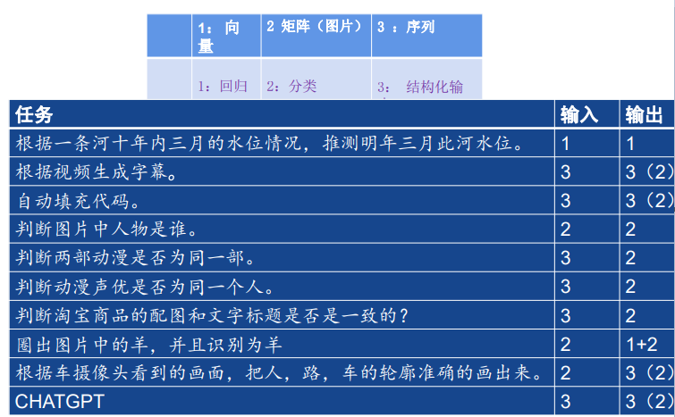

传统机器学习算法：
    KNN：是一种监督学习算法，用于分类和回归问题
        基本思想：通过测量不同数据点之间的距离来进行预测
        工作原理：距离度量、确定邻居数量K、投票机制
          
    决策树：  
          
    朴素贝叶斯
        
深度学习：
    是机器学习的一个子类，利用多层神经网络从大量数据中进行学习
    
神经网络：
    常见的神经网络的输入：  
        向量、矩阵/张量、序列
        常见的输出：  
        回归任务：能够预测结果  
        分类任务：分析人脸得出情绪，分析疾病判断症状
        生成任务：生成文件、图片

    练习：
深度学习任务
    分类和回归是结构化的基础
    分类的时候是用数字来表示类别
    可能需要多模态数据：声音，图片，文字

回归与神经元
    如何开始深度学习：
    1、定义一个函数(模型)
        计算loss：
        torch框架可以帮助自动计算，优化模型
    2、定义一个合适的损失函数
    3、根据损失对模型进行优化

线性函数与多层神经元
    