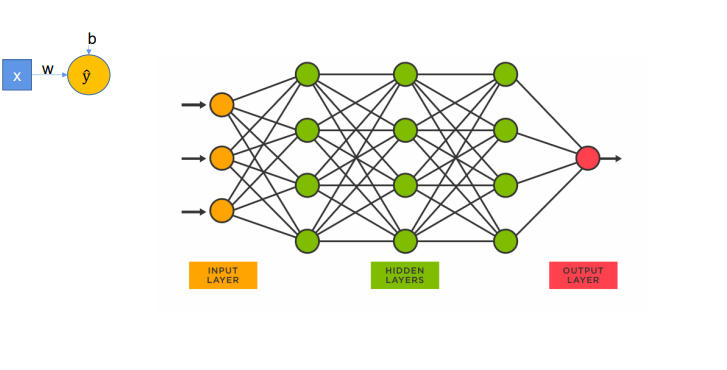
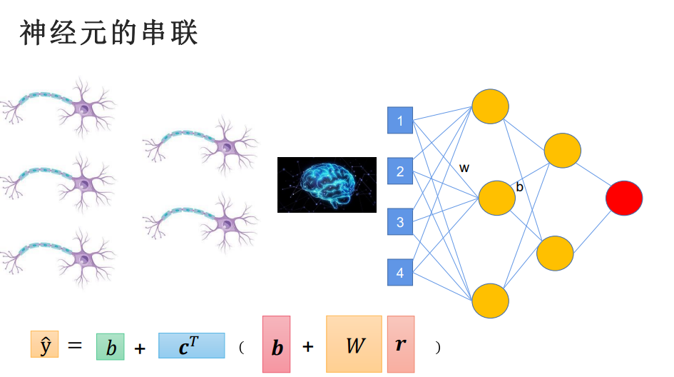
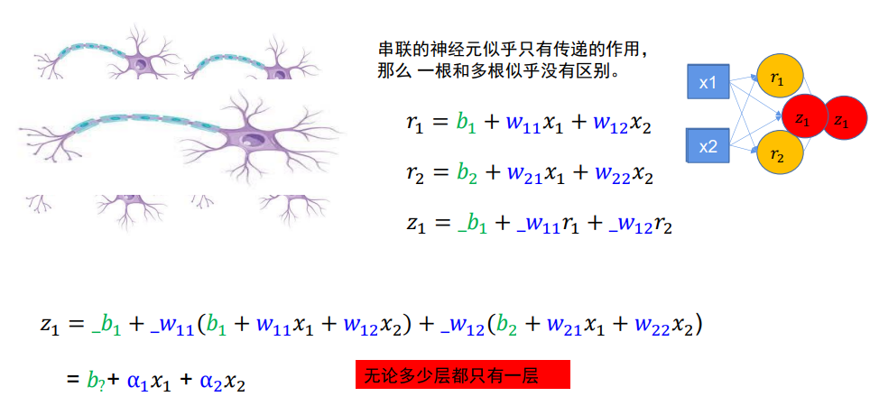
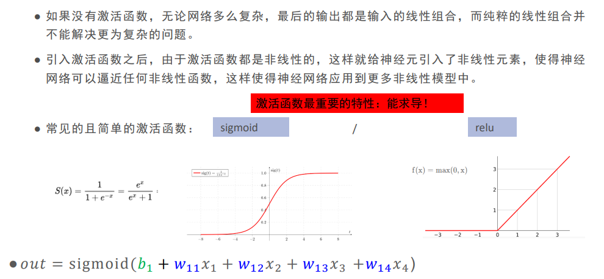
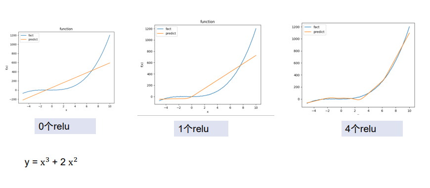
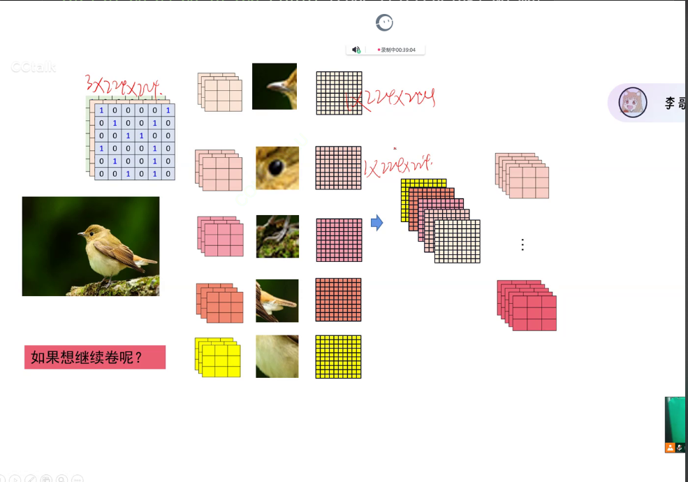

# 多层神经网络：  


> **问题**：串联的神经元似乎只有传递作用，一根和多根貌似没什么区别  
          
> **解决**：使用激活函数：比如relu、sigmoid（relu的效果一般比sigmoid要好）  

## 激活函数和非线性函数  
>  
>  


### 一个神经网络的训练过程

#### 基础知识:  
张量是多维的数值数组,可以包含标量、向量、矩阵以及更高维的数据结构。  
基本上必须要用到的包:  
- torch
  > 用于完成创建张量,自动求导（计算梯度）,帮助完成线性回归  
  > 如果需要一批数据用于测试推算出一个用于估算结果的函数,那么需要定义一个函数用于生成数据,同样也需要用到torch包 
- matplotlib.pyplot as plt
  > 用于绘图  
- matmul
  > 用于表示矩阵相乘,也就是用到torch包完成矩阵运算  

##### 举例:
根据多个属性得出一个评判结果,外貌性格财富内涵等等 预测一个人的恋爱次数

#### 神经网络的目标
 
# 正文

完成线性回归需要:

### 1、找一批用于训练的数据,通过create_data函数生成
定义函数create__data用于生成数据
``` python
def create_data(w, b, data_num):
    x = torch.normal(0, 1, (data_num, len(w)))#设置数据的形状,data_num表示数据的个数,len(w)表示数据的维度
    y = torch.matmul(x, w)+b//matmul表示矩阵相乘

    noise = torch.normal(0, 0.01, y.shape)#噪声要加到y上,给y做一个扰动
    y += noise          #加上噪声

    return x, y
```

``` python
num = 500  #表示生成500个数据
#根据X,Y推测出w,b
X, Y = create_data(true_w, true_b, num) 
true_w = torch.tensor([8.1,2,2,4])#转为列表 w （张量）
true_b = torch.tensor(1.1)

plt.scatter(X[:, 3], Y, 1)  #绘制散点图,X[:, 3]表示取X的第四列,Y表示Y的值,1表示点的大小
plt.show()
```
定义函数data_provider函数用于取数据  
``` python
def data_provider(data, label, batchsize):     #每次访问这个函数可以提供一批数据
    length = len(label)#这个是用于计算数据的长度
    indices = list(range(length))#range(length)表示0-500的列表
    #不能按顺序取  需要把数据打乱
    random.shuffle(indices)#打乱数据,也就是把0-500的数据顺序打乱

    for each in range(0, length, batchsize)://每次取batchsize个数据,batchsize是根据传过来的参数定的
        get_indices = indices[each: each+batchsize]#每次取batchsize个数据
        get_data = data[get_indices]#根据索引取数据
        get_label = label[get_indices]#根据索引取标签,标签是用于推算结果的
    yield get_data, get_label
```
> **通过索引取数据的优势：**  
- 随机抽样：通过索引可以实现随机抽样，这在训练机器学习模型时非常重要。随机抽样可以打破数据的顺序性，防止模型过拟合。  
- 批量处理：通过索引可以方便地实现批量处理（batch processing）。在处理大规模数据时，分批处理可以减少内存占用，提高计算效率。  
- 数据增强：在深度学习中，数据增强（data augmentation）是常用的技术。通过索引可以方便地对数据进行各种变换和增强。  
- 灵活性：使用索引可以更灵活地操作数据。例如，可以根据某些条件筛选数据，或者在不同的数据集之间进行交叉验证。  

- **`yield`**  #有存档点的return,下次调用时,从这里开始  
> **通过多轮次按批取数据，可以提高效率以及利于模型加快收敛：**
``` python
batchsize = 16
for batch_x, batch_y in data_provider(X, Y, batchsize):
    print(batch_x, batch_y)
#注意:可以通过调试,查看batch_x和batch_y的值,看看是否是我们想要的值
``` 

### 2.定义一个模型(函数)用于推算预测值pre_y(这个函数需要构造出来)  
定义函数fun返回预测值
``` python
def fun(x, w, b):#w是权重,b是偏置,x是输入
    pre_y = torch.matmul(x, w) + b￥矩阵相乘
    return pre_y#返回预测值
```         
### 3、定义函数maeLoss用于计算损失  #；loss就是预测y和真实y的差值 loss产生梯度 用于减小偏差 并且只需要偏差loss产生的梯度
``` python
def maeLoss(pre_y, y): #pre_y是预测值,y是标签
    return torch.sum(abs(pre_y - y))/len(y)#返回损失值
``` 
### 4、定义一个函数计算梯度(用于优化,这个函数的参数是一个张量,返回值是一个张量)
``` python
def sgd(paras, lr):     #随机梯度下降,更新torch.tensor  张量
    with torch.no_grad():  #更新参数不需要计算梯度  即属于这句代码的部分,不计算梯度 
        for para in paras: #遍历参数
            para -= para.grad* lr   #用于更新参数 不能写成 para = para - para.grad*lr
            para.grad.zero_()       #因为每条梯度在计算的时候会不断累加,计算新的梯度就要将使用过的梯度,归0  
``` 
准备工作做好了,接下来就是训练模型了  
过程也就是随机选择一个w和b,然后计算预测值,计算损失,计算梯度,更新w和b
### 5、定义一个函数用于训练
``` python
lr = 0.001  #设置学习率
w_0 = torch.normal(0, 0.01, true_w.shape, requires_rad=True)    #设置一个随机值w  要有形状  这个w需要计算梯度:用requests_grad=True  
b_0 = torch.normal(0.01, requires_grad=Ture)                    #设置一个随机值b
print(w_0, b_0)

epochs = 1000#设置训练轮数

for epoch in range(epochs):
    data_loss = 0
    for batch_x, batch_y in data_provider(X, Y, batchsize):#取一批数据
        pred_y = fun(batch_x, w_0, b_0)#得出预测值
        loss = maeLoss(pred_y, batch_y)#计算损失 （batch为真实值 pred为预测值）
        loss.backward()#梯度回传,求出所有的loss
        sgd([w_0, b_0], lr)#更新模型 也就是计算梯度,优化
        data_loss += loss  #累加当前轮次损失值，得到loss

print("epoch %03d: loss: %.6f"%(epoch, data_loss))  #03d表示输出三位整数,.6f表示输出六位小数
``` 
> 如果loss也就是梯度变化的太小了,说明学习率太小,需要调大学习率
> 目的就是训练模型,让模型的预测值和真实值尽可能的接近,也就是让loss尽可能的小

### 6、可视化
把函数图形 ,散敛图画出来
``` python
idx = 3#表示取第四列
plt.plot(X[:, idx].detach().numpy(), X[:, idx].detach().numpy()*w_0[idx].detach().numpy()+b_0.detach().numpy())#画出预测值,只能取某一列
#.detach().numpy()表示将张量转为numpy数组
plt.scatter(X[:, idx], Y, 1)#画出真实值
plt.show()#显示图形
``` 
<<<<<<< HEAD
=======

>>>>>>> ba69793ff1f69620c5c16a6eda8a40610a6826d0
