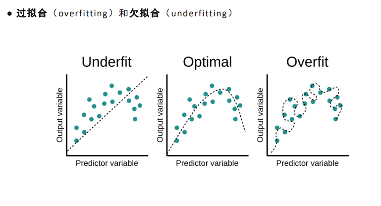

# 一、补充基础知识：
### 过拟合:  
是指模型在训练数据上表现得非常好，但在新数据上的表现差。这是因为模型在训练过程中学到了数据中的噪声、细节，甚至是一些不重要的模式，而不是提取出数据的真正规律。
 
### 泛化能力：
没有验证集进行调整的情况下，模型无法进行有效的超参数调优和结构调整，因此它可能只在训练集上表现得很好，而在新数据上的泛化能力较差。泛化能力是指模型从训练数据学到的规律能否有效地应用于未见过的数据。

# 二、正文
### 1、一个深度模型是在做什么？
    拥有一批x和y，通过模型预测到一个好的y
    再通过真实的y和预测的y，计算出差距也就是loss
    然后通过这个差距去改变优化模型，得到更好的模型，让模型更好的预测y
    不断多轮次的训练去预测更加准确的y

### 2、训练流程：
    数据处理

    定义模型

    超参数设置：(人为指定)
        包含：学习率，优化器，损失函数等等
        回归损失函数：Loss = 1/n * ∑(y - y')^2

### 3、训练集,验证集,测试集  
    1.训练集：用于训练模型
        数据要随机取，不要太局限于小范围，数据集往往能够极大地决定模型准确度的上限

    2.验证集：用于验证模型，优化模型   只做验证，不做训练
        用于调整超参，调整模型结构

    3.测试集：用于测试模型的泛化能力

###### 回归模型用于预测一个值，看预测的值和真实值是否相近
###### 分类任务就是看分类的准不准确
>#### Dateset类：吃文件地址，提供数据（x,y）  
> **init #初始化**
> **getitem #获取数据**
> **len     #获取数据长度**

算出所有的loss，全部加起来，然后求平均值，这个值就是loss

更新模型参数是一批次一批次的更新，不是一次更新所有的参数
    一个轮次就是一个epoch，一个epoch就是一批次

···········
### 4、模型部分
当准备好训练集、验证集和测试集后，就可以开始训练模型了。

##### 模型分为两部分：
    1.初始化模型参数 即搭建模型
    2.forward  规定数据流向 

##### 需要关注模型的维度如何变化
    可以linear直接变为一个全连接层
    (16,93)  16为样本，93为维度
全链接变换的是最后一维

·············
#### 5、超参数部分
    1.学习率
    2.优化器
    3.损失函数
    4.训练集、验证集、测试集

**注：动量 理解为惯性**
**验证集只能验证模型，不能训练模型，也就是说验证模型的梯度不能积攒到模型中**

##### 过拟合问题：
    用正则化来缓解过拟合
##### 相关系数：线性相关（selectKbest） 

##### 主成分分析算法PCA  作用为进行降维

##### 设计网络并计算参数
    Linear(x, y)  参数量为x*y+y