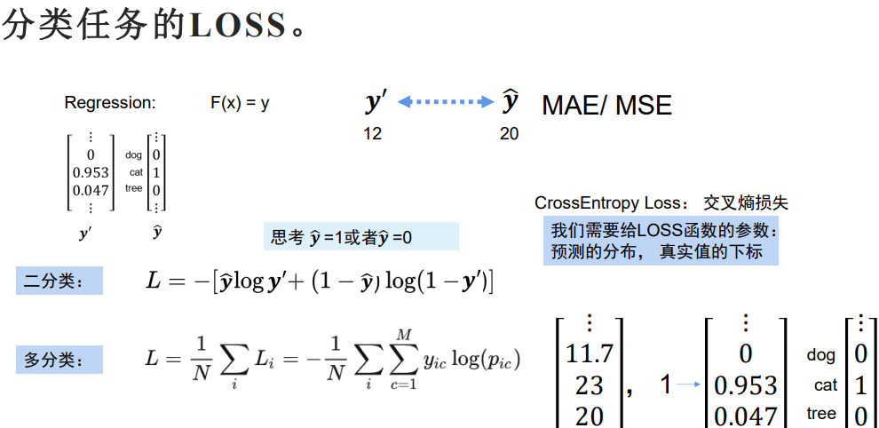

# 分类任务：才正式进入深度学习的领域
## 1.nn.Linear  
    作用：随意转换矩阵的维度  

    在中间多算几次，可以加深网络加强效果  
#### (1)梯度下降算法  
    处理数据集(训练集，验证集，测试集)  

#### (2)分类与回归之间区别就是输出不同  
- 回归：是找一条线，模拟原有的数据，从给定的x值，预测出y的值  
- 分类：找一条分界线，将数据分为两类，也就是找出两类数据之间的分界线  
>**如何输出一个类别** 
**误区**：输出一个类别，结果离谁近就属于哪一类  
**方法：**  
>- One-hot独热编码(用01向量表示)  
            ·如：[0,1]表示属于第二类，[1,0]表示属于第一类  
            每个元素都代表不同的类别  
            看向量最大值所在的下标就是他的类别
- 图片分类：将图片转换为向量，然后进行分类
>- **图片分类的方法：**
            1.将图片转换为向量(图片大小一般规定为224x224)  
            标签y为向量  即概率分布 求分布之间的loss  
            2.将向量输入到神经网络中  
            3.输出预测值  

## 2.卷积神经网络：**对应矩阵(卷积和)的卷积操作 得到特征图** 
- **一般只需要关注到小的特征图**
    (图片天然就是矩阵)卷积核是三层矩阵在卷积

- **因为卷积之后的矩阵会变小，如果想要保持图片尺寸不变：**
  需要填充0(即使用ZeroPadding)ZeroPadding1卷一层即添加两列，ZaroPadding2卷两层即添加四列  
- **卷积核大小不变，但是厚度会变** 
    卷积核参数量就是卷积核大小平方乘以厚度
- **如果引入维度，就是引入卷积核**
一个卷积核就可以卷出来一张特征图

#### (1)**卷积神经网络计算：**
        特征图大小为卷积核卷出来的个数
        卷积核的参数量即卷积核大小*厚度*卷积核数量

>
>**I ：输入特征图高度 （一般高度宽度一致保证为方阵）**

- 每次卷积出新的特征图的通道数(深度)为该次卷积的输出参数
- 特征图高度为卷积计算结果(按理说是越卷越小)

- adaPoolq强行重置特征图高度宽度
- Pool(3,2)表示池化窗口大小为3，步幅为2

- **卷积操作后，通常会使用激活函数（如 ReLU）引入非线性，增强模型的表达能力**
#### (2)特征图变小的方法: 降低采集量
- **1)扩大步长**：就是将特征图行列分别除以步长大小
**缺点:** 会丢失信息，还会引入计算
- **2)池化(pooling)：** 无参数量，不会引入计算 减小特征图尺寸的作用，用一个数代表多个数
>**最大池化(首选)**:每n个元素取最大值
**平均池化：** 每n个元素取平均值
        ⚠一般池化用的多，扩大步长一般不用
- **3)卷积**
>可以用maxpooling(7) #7表示7个数中取最大值
        convd(a, b, c,)三个参数分别表示维度、高度、宽度
            其中a表示通道数，b和c分别表示每个通道数的高度和宽度

>- **卷积完后得到单层或多层特征图**
**特征图展开成向量**
向量输入到全连接层
>- **中间可以任意添加全连接层（linear）**
**Linear:数学表达式：** [ y = Wx + b ] 其中，( W ) 是权重矩阵，( b ) 是偏置向量，( x ) 是输入向量，( y ) 是输出向量
**用于将输入特征进行线性组合生成新的特征**
>- **全连接层：** 将特征图拉直变成向量用于模型训练
>- **输出预测值（类别）**
---
### (3)分类的loss：
**让标签变成概率分布，然后求分布之间的loss**  
>- **将向量变成概率分布**  nn.softmax()   
import torch  
import torch.nn as nn  
>- **将标签值转为张量**  y=torch.tensor([1,0,0,0],dtype=float)  
>- **将向量变成概率分布** soft = nn.Softmax(dim=-1)  
**此时的y' 和 y^都是概率分布**  
>- **利用CrossEntropy Loss**：(交叉熵损失)计算loss  
>- **分类**：二分类和多分类
   >
>- **forward(前向过程)**：从输入到输出的过程
>- **backward(反向过程)**：从输出到输入的过程
>- y'为预测值
>- y^为标签值也就是真实值
>- 分类任务 loss(模型输出值，标签值)
>- 将图片转为矩阵 然后铺开成向量 进而进行分类
>- **梯度回传 进行回归**loss.backward()

---
#### (4)图片分类神经网络的发展：
    (sota模型 最好的模型）
###### ①.LeNet 
###### ②.AlexNet(经典神经网络) 创新点：
>- **使用ReLU激活函数**
>- **使用Dropout** 随机选取神经元 缓解过拟合
>- **池化**
>- **归一化:**  
可以加快数据集的收敛  
防止数据受量纲影响  
缓解梯度消失和梯度爆炸
>- **Batch Norm 批归一化**  
数据集通过卷积得到新的数据集，然后对其进行归一化
###### ③.ZFNet
###### ④.VGGNet:通过卷积 用小的卷积核代替更大的卷积核，并且能做到参数量共享
###### ⑤.ResNet:残差网络
>- **解决模型越深效果越差的问题**  
如：梯度消失 & 梯度爆炸  
>- 残差块
>- 残差网络
>- 残差网络的变种
>- 残差链接：将前面的特征图直接加到后面的特征图上