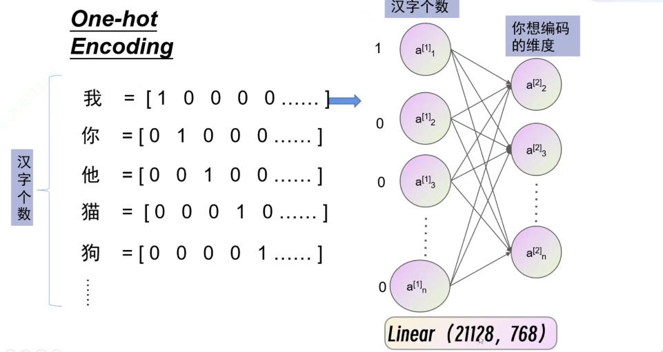
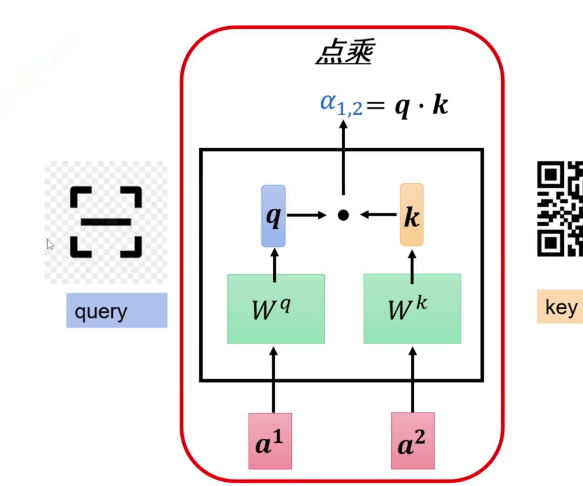
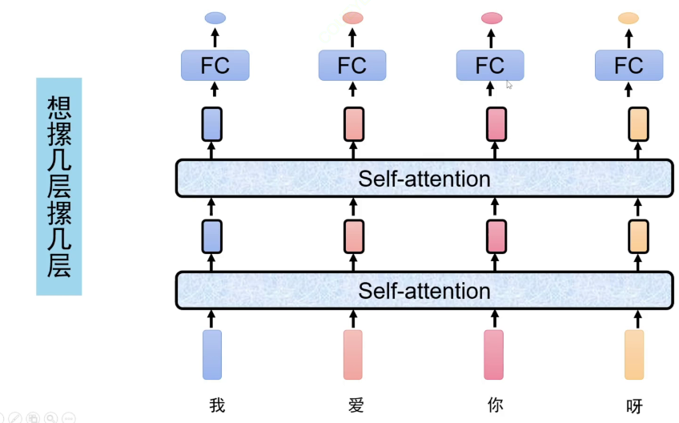
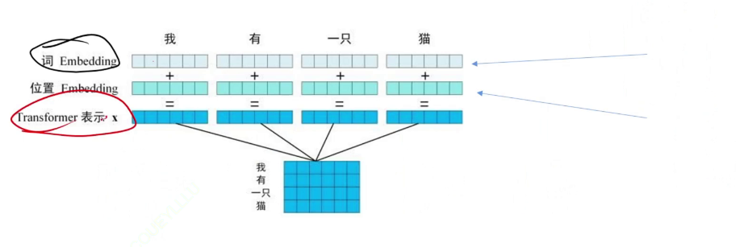
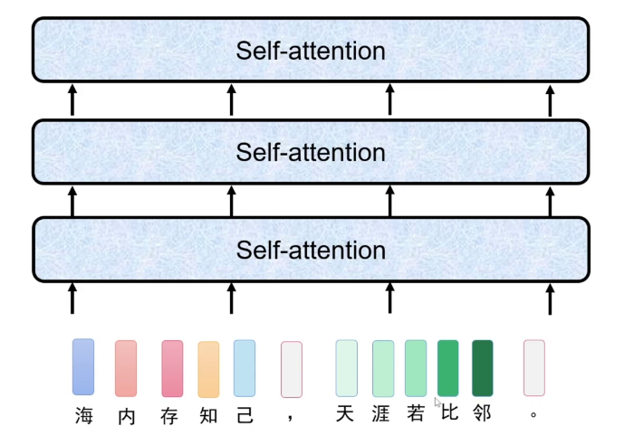
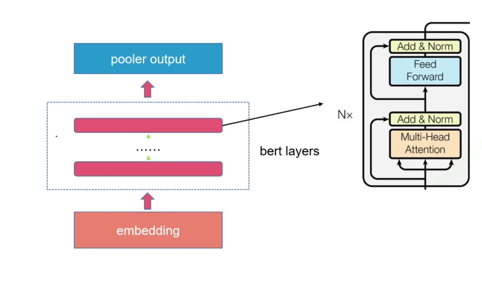
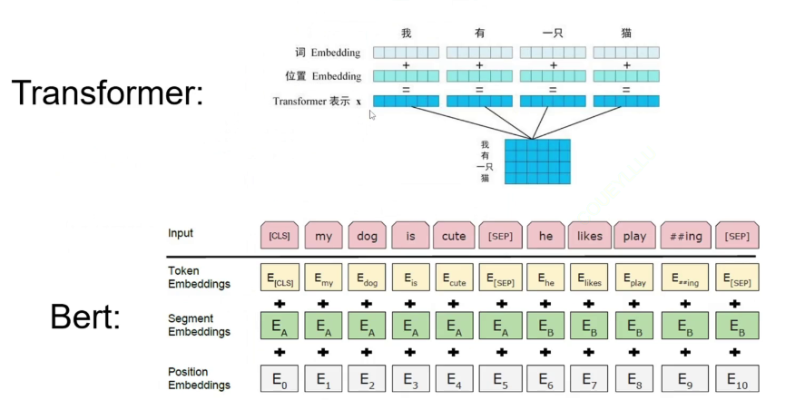

self=attention 自注意力机制 （基础架构）
用于自然语言处理

1、常见输入：(图片、文字、声音)主要探讨文字
    把每个子处理成一个一个的向量，如何做？
        ·采用one-hot encoding来准确表示每个文字 ,为了更好的表示文字的含义加入word embedding让含义更近的向量更加贴近

        模型学习过程:考虑向量为度(也就是长度) 进行全链接 链接到想要的编码的维度
                    通过全连接改变原来向量的维度到768维
    具体是把输入的文字变成编号传给模型（也就是字典的制作）
        输出:
            1、可以是一个字输出一个值
                词性识别器ExampleApplication
            文字输入是序列，要考虑每个文字前后之间的关系（图片每一张都不一样所以不需要考虑）
                ·<!-- 引入rnn循环神经网络：传入模型一个记忆单元（可以存储之前的记忆）和一个文字向量，输出记忆单元和文字的词性，接着下一轮的输入
                但是不利于长序列 -->
                ·使用LSTM长短期记忆来判断长序列
            但是RNN和LSTM太慢了只能一个接一个处理文字，不能并行处理
            解决:
                self-attention特征转换器（仅仅是为了得到特征向量，向量维度并不改变）
                将所有文字向量一次性都输入self-attention
                给每一个输入分配一个注意力。但是分配多少注意力，如何计算注意力呢
                    用点乘：

                        得到注意力值后通过softmax得到和为1的注意力a，然后再乘以value之后把每个结果相加得到b1
[alt text](images/image-16.png)
                        输入输出都是768维
                实际处理中不会把768维度直接全部输入，而是采用多头自注意力机制分批次输入

                实际中不会仅仅就放一层self-attention，可以多加几层（反正维度不变）

                但是向量输入的位置需要考虑，防止位置打乱，所以给每个向量加一个位置向量（维度相同）将两者直接相加输入模型self attention

                

            每个向量被称作为token
            transformer解析图：（bert）

                feed forward其实就是全链接
        BERT：特征提取器
            1、首先在大规模文本上进行无监督预训练然后迁移过来做成自己的预训练模型
            2、bert在预训练中有两个主要任务：
                1、masked langudage model
                    将部分内容遮住来训练，使其获得特征提取能力
                2、next sentence prediction
                    判断前后两个句子是否相邻 
            3、bert的组成：  

                bert layers其实就是transformer结构，每一层其实就是transformer层
                1、输入embedding

                每个向量加一个位置向量还要加一个句子编码（segmentEmbedding）表示词在第几个句子 

                经过计算得到输出结果
                经过linear
                2、输出pooler output
                    经过self attention只输出cls头
        bert的实战：（主要是下游分类任务，没有预训练部分）
                1、首先需要一个分词器tokenizer将一句话分成多个词
                        一个词的内容为input ids（编码）、mask（告诉模型输入的token的长度，用padding来辅助规范固定长度）、seq_ids（句子编码）  
                2、然后bert参量的计算
                3、接着利用分词器：tokenizer

            1、data产生两个dataloader：trainloader和vallaoder
            将文本数据进行预处理，将其转化成训练模型所需要的数据
            
            如何区分验证机和测试集？
                用sklearn.model_selection import train_test_split,给x，y和分割比例，分割出来一个训练集和验证集的x，y

            2、模型：用bert
            模型加载bert，然后放入类别数量，通过lieaner将向量维度进行调整

            forward向前传播：
                载入字典
                用分词器self.tokenizer分词
            
            3、train训练模块：
            相比于图像分类的基础上
            仅仅在训练轮次中加入scheduler调整学习率，加入torch.nn.utils.clip_grad_norm()进行梯度裁切，防止梯度爆炸

            4、超参数：
            lr, batchsize, loss, bert_path, num_class
            model, optiminizer,train_loader, val_epochs(表示训练多少论验证一次), epochs(对于attention架构一般在前几轮训练的就差不多了)save_path, schedular（改变学习率：余弦退火：一开始学习率很高，后面逐渐降低）

            5、根据tran_val写主函数，只需传入一个字典

            2、可以是所有字结合起来输出一个值
                比如说判断一句话产生的情感 输出只输出负或者正
            3、亦可以输入输出长度不对应  
                比如翻译
         