采用迁移学习：直接用torch把别人已经训练好的特征提取器调过来用
            不仅仅要用人家的模型还要用人家的参数
                如果完全相信别人的参数就是用：线性探测
                如果不完全相信别人的参数就是：微调

先定义一个函数
然后计算得出loss（求平均值）

求得loss损失函数之后用于优化模型optimization
        梯度下降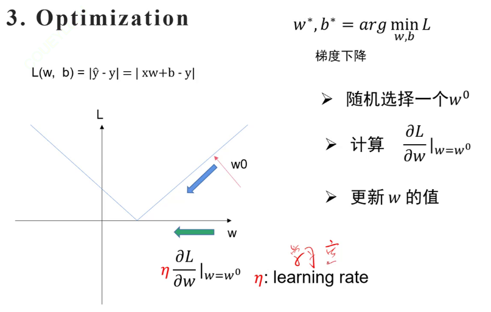
    w是权重，b是偏差

    损失函数：交叉熵（分类）、均方误差（回归）

回归任务：
    使用激活函数relu 或者sigmoid     relu就是会比sigmoid防止梯度消失
    如果不用激活函数，神经网络无论有多少层都只能表示线性变换，没法拟合复杂的非线性数据

    梯度消失与梯度爆炸

    批归一化：
        通过归一化每一层的输入分布来加速训练并提高模型的稳定性。通过对每个小批量的数据进行归一化，使得每一层的输入分布更加稳定，进而缓解梯度消失和梯度爆炸的问题    
优化器：
    sgd、momentum、adam、adamw
------------------------------------------
图像分类模型的过程：
    让图片通过卷积神经网络提取特征，通过分类头得到分类结果，和标签计算交叉熵，更新模型

    卷积操作本质就是通过滑动窗口再输入数据上提取局部特征

模型：
    ·resnet 18 表示网络中包含十八层有权重的层（包括卷积层和全连接层）
         1x1的卷积和残差链接    用于解决：模型越深反而效果越差
            1x1卷积可以减少参数量并且降维
        ·通过引入残差链接来缓解解决梯度爆炸和梯度消失的问题
        ·resnet结构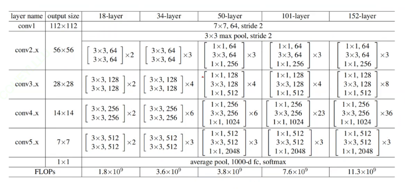
    
    ·~模型的一个具体的训练过程：分batch_size，取一组数据训练模型是一轮，然后反复许多轮次进而训练出一个不错的模型，以预测到一个准确度很高的y

    ·linear全链接：可以通过矩阵乘法把维度进行改变
        要会计算网络的参数量：w*b+b
        

        可以加深网络加强效果
输入的处理：
    数据集：只有验证和测试的时候用原图，训练的时候才要对图片进行增广，各种调整变换

        图片一般天生就是三通道的矩阵，要将其处理得到一个向量（那么就要采用卷积）。如果直接将三通道图片拉直成一条向量，直接用全连接得到参数量，但是参数量太大了，容易造成过拟合，解决方法用的是卷积神经网络，用卷积核去卷原始图片得到特征图（用不同的卷积核可以得到不同的特征图，感受野会不同，鸟嘴，鸟眼。。。），卷一次一般不够，要卷很多次，得到不同的特征图组合起来得到一张新的特征图，这个过程被称为一层卷积（原始特征图有多深那么卷积核就有多深）
        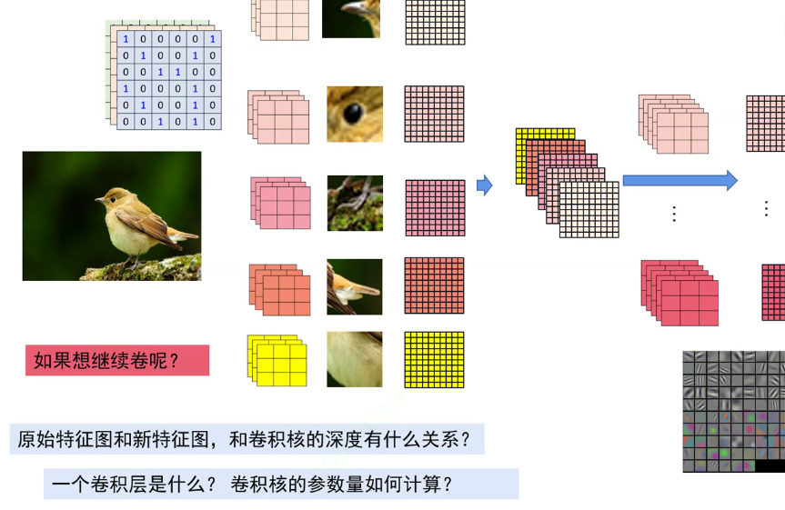
    特征图变小的方法（降采量的方法）：
        1、扩大步长（卷积核卷的时候每次移动两格）
            卷积尺寸计算公式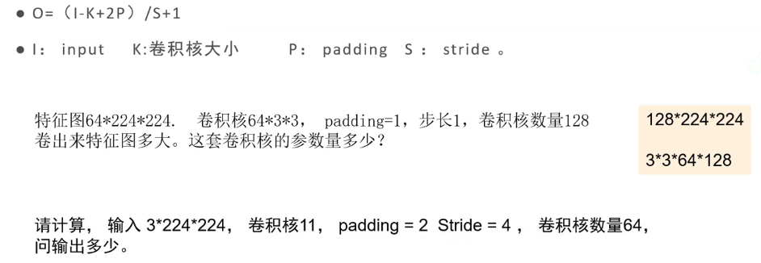    
        2、池化pooling（更为常用的方法）：直接用一个数表示四个数
            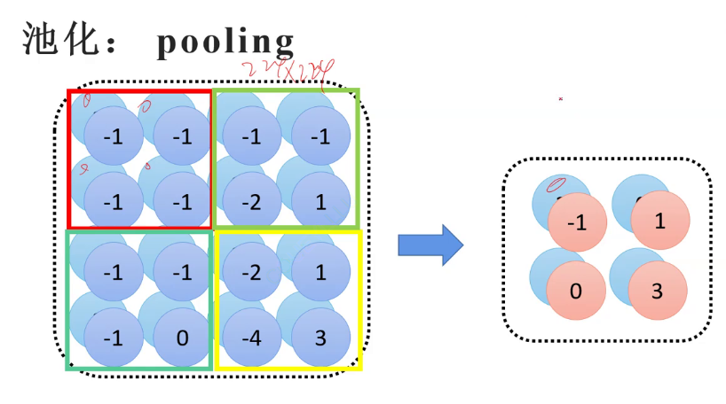
            方式：最大池化（用的多，因为不用计算，方便） 2x2的矩阵里选择最大的数代表这个矩阵maxpooling（7）：每7x7一个代表数
                        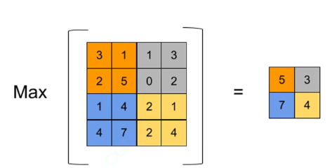
                平均池化
                        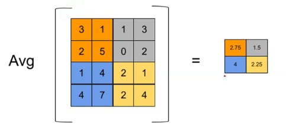
        得到卷积过后的特征图后：拉直成一条矩阵（也就是得到了分类头），然后通过linear随便变换成想 要的维度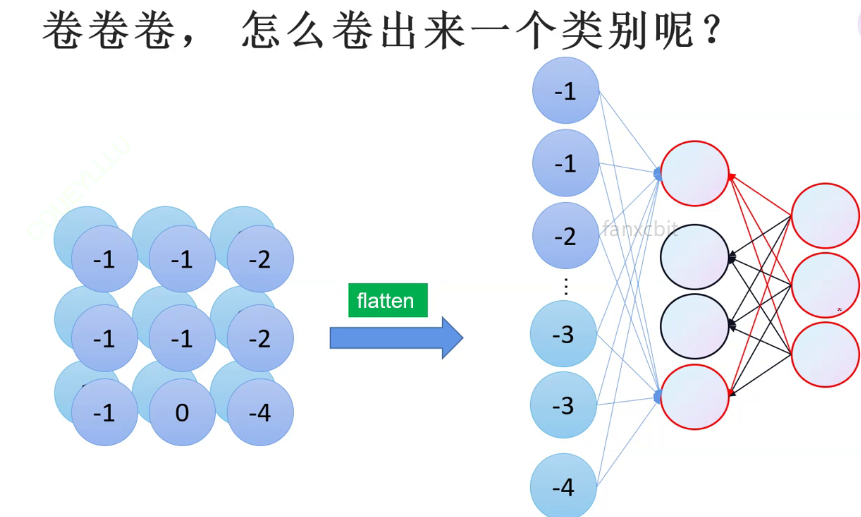
    分类的loss：
        ·得到想要的维度的概率分布y'之后要对其中的元素进行处理，将元素变成概率分布
        ·用softmax()来处理得到概率分布y^（one-hot独热编码）
        ·然后用**交叉熵损失** 来用y'和y^计算出loss
        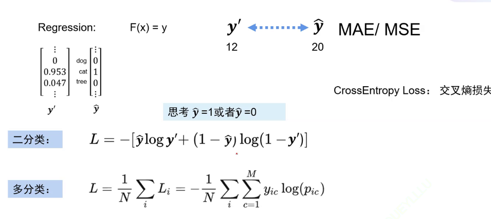
----------------  以上数据输入的处理的整个过程叫做前向过程，目的得到loss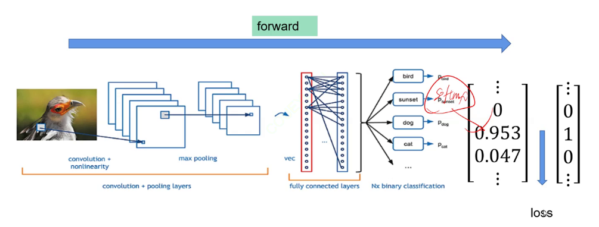  ----------

前向过程之后然后进行梯度回传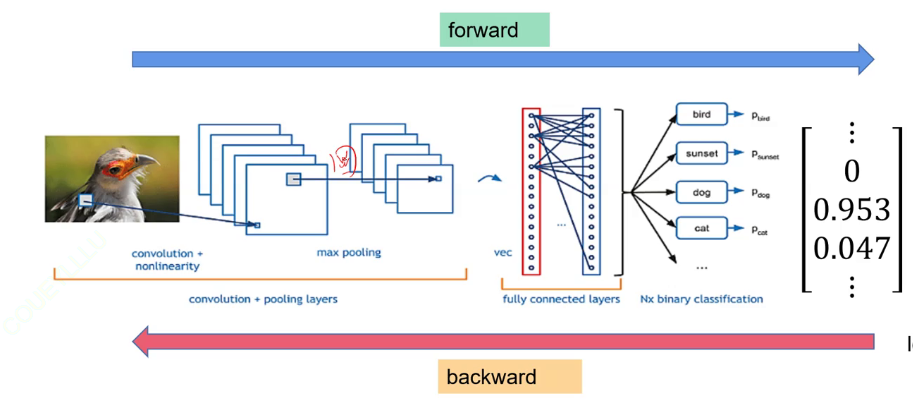得到其中每一个卷积核上的每一个权重的梯度，然后就可以更新模型，完成backward的目的，这一切都回到了回归任务上，一模一样

卷积和全连接的关系：
    卷积是一种参数共享的不全链接，卷积使得参数量大大减少

alexnet:drop out可以缓解过拟合
vggnet:更深更大 用小卷积核代替大的卷积核

    图像增广：
    对图像（数据集）进行预处理（各种变换调整）
    
    主成分分析（PCA算法）技术可以将图片数据进行降维

输出：
    输出类别 用one-hot独热编码来表示类别，向量中最大值作为下标作为预测类

transformer
    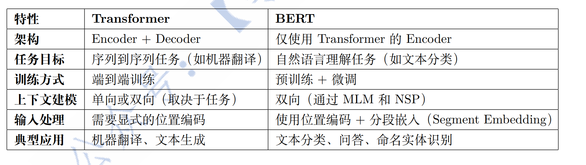