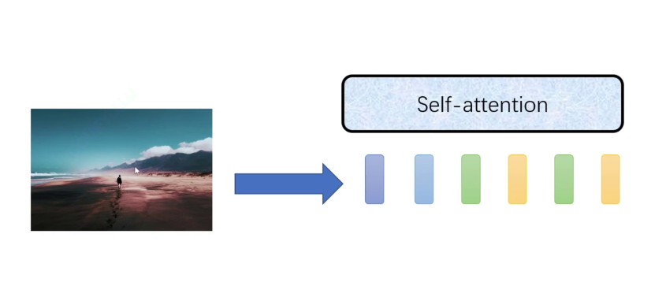
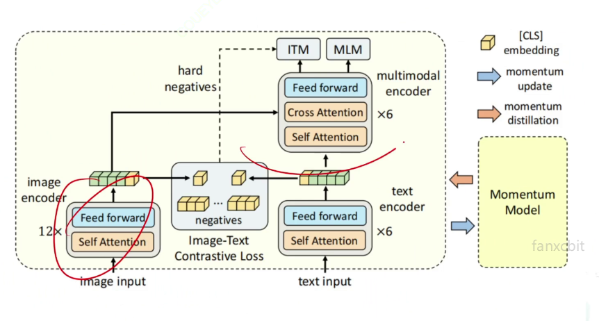
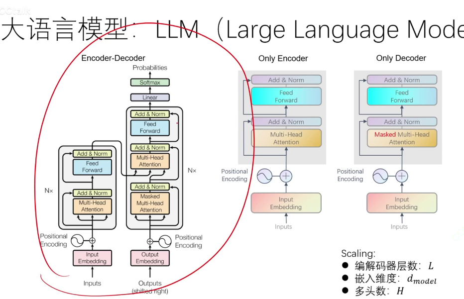

一、Transformer自注意力机制

Vision Transformer（VIT）
    将自注意力机制运用于图片：
        把图片变成token序列，可以将像素变成token
        要做到的就是，将图片离散化为一排向量
        
    只需要把图片变成一排向量，就可以让transformer自由进行交互

二、复试看重你科研的能力
喜欢深度学习的哪个领域

模型：
1、多模态 图文
    例如：图片文字检索
    多模态：包含图片、文字、声音
    Bert天然为多模态而生：不管输入是什么图片还是文字都变成向量放进自注意力机制里进行交互

2、viltBert出现的原因：
    由于预训练参数的原因，bert预训练是没有图片参与的，viltbert可以使得与训练参数可以让图片文字参与，让图片分成一小块一小块输入
3、visualBert
    直接把图片中的对象扣出作为输入

4、ALBEF模型：
    预训练很复杂，双流方式
    
三、深度学习常见研究方向
医学图像：分类、分割、检测

异常检测：异常攻击、异常流量（网络安全可能涉及的多）

可解释性：（数学方面做的多）

分子结构预测：将分子结构转成立体图像

颅面复原到人脸

图片分类
文字情感分类

如何做更好的自监督、半监督、无监督

分布式训练：

大语言模型：
    预训练方式：only decoder架构
                next token prediction，预测下一个字
    指令微调阶段
    人类反馈强化学习：根据反馈进行调整强化学习
（注意：强化学习是人工智能未来的钥匙

设计更好的学习率
设计更好的优化器
设计更好的loss
设计更好的模型架构
更快的计算方法
更少的模型参数 如何把一个大模型部署到一个小的单片机上

回归任务是很简单的任务

重点应该放在对数据的处理上
    如何挑选想要的特征
训练技巧
    正则化，dropout。。。。。

对不同模型的理解：vgg、resnet
对不同的数据集如何迁移学习的
对数据做了什么处理，使用了那些数据增广方式
如何处理无标签数据的，半监督实现原理
不同激活函数有什么不同，各有什么优缺点