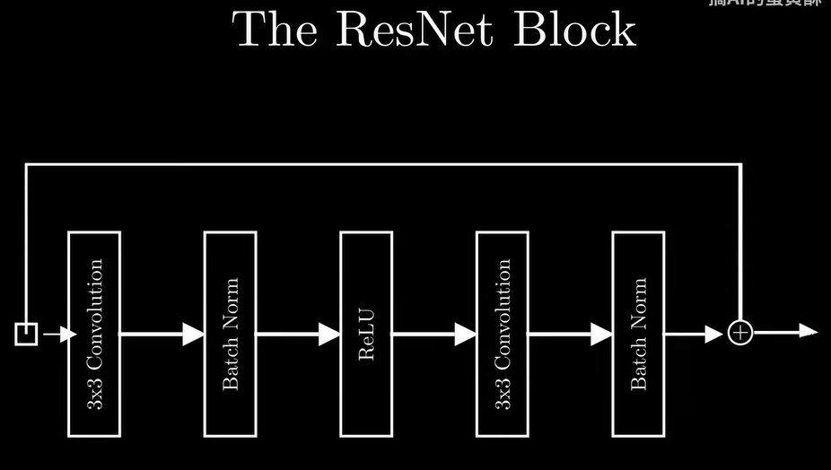

文字分类任务：
<!-- bert只用transformer的encoder(由 Self-Attention 和前馈神经网络（FFN）组成)部分 -->
1、首先输入文本，bert将其通过wordpiece分词法拆分成一个一个词token
<!-- 其中采用one-hot encoding来准确表示每个文字  -->
为了更好的表示文字的含义加入word embedding让含义更近的向量更加贴近，然后将词通过bert词汇表(也就是词典)映射为成token id，形成整数序列

2、token id进入bert嵌入层embedding转为词向量，然后加上位置编码和分段编码形成供self-attention处理的向量 token
<!-- self-attention是Transformer的一部分 -->
    然后输入transformer层，也就是bert layer里，进行多头自注意力muti-head attention(self-attention)计算(增强token的表示) 得到新的上下文向量，防止梯度消失或爆炸。
<!-- transformer主要是由多个encoder层进行堆叠，然后每一层都有self-attention -->
    然后Softmax 归一化后，得到每个 Token 对其他 Token 的注意力权重。
    增强token的信息表示
<!-- bert和transformer之间的关系 -->

    bert采用残差链接和层归一化来防止梯度爆炸和梯度消失

    然后经过一个两层的前馈神经网络fnn。

    然后进行残差链接和层归一化

    然后传到下一个transformer层循环执行上述操作

3、然后通过Bert layer层之后进入outpooler层输出cls向量，并通过 全连接层（FC）进行线性变换得到一个新的向量，其维度取决于分类任务的要求(比如要分成多少种类型)
4、最后经过Softmax激活函数进行归一化，得到概率分布，最后将由最高概率的类别作为模型的预测类别

图像分类任务：

使用公开数据集，将训练集进行增广，通过迁移学习使用resnet18作为基础模型，模型训练中使用adamw优化器以优化损失函数和调整学习率等超参数

resnet：
在整个网络中添加残差连接，这样子可以增强输入信号在网络中的传递，还可以使得输入和输出的相加变得更加容易 每个块可以轻松地输出恒等函数（不做任何改变）不会对损失函数产生负面影响

resnet每个残差块：
将输入通过一个3x3的卷积层

    两个卷积层，之间经过的激活函数对数据x进行的处理叫做 F(x),在第二个卷积之后进行求和 F(x)+x，然后再经过一个激活函数(relu)，那么这个处理分支叫做identity  
        使用padding填充0的方法来保证特征图经过残差块处理之后大小不变
        使用1x1的卷积核来将通道变成一致的
    以上两个措施可以保证避免梯度消失
    ·随着网络层次的增加，不会让网络性能变得更差

