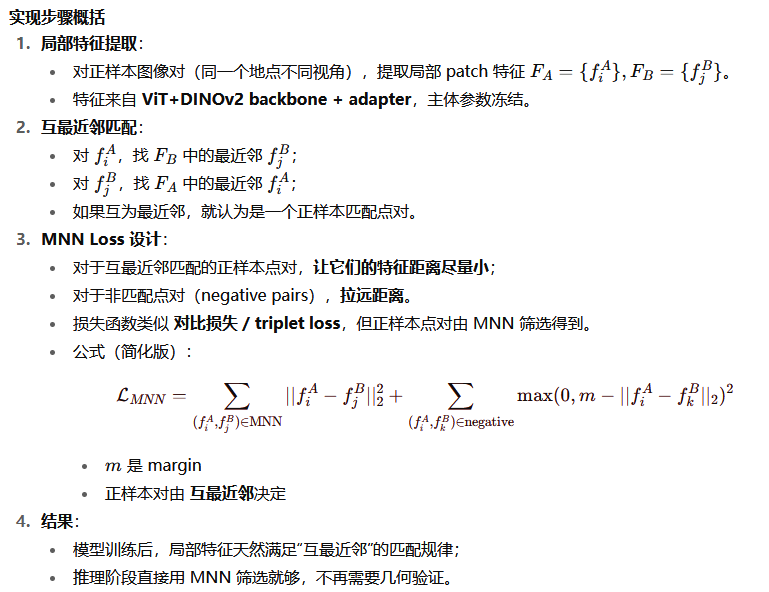

# 论文：TOWARDS SEAMLESS ADAPTATION OF PRE-TRAINED MODELS FOR VISUAL PLACE RECOGNITION
# (ICLR 2024)
  大多数方法需要进行几何验证，该论文尝试使用视觉基础模型不进行几何验证，生成局部特征进行重新排序，进而加快VPR的检索过程  

### tips  
- 3项构建基础模型的要素，分别是网络架构，预训练算法，robust learning
-  VIT是一种将transformer运用在CV领域的模型
- 参数高效迁移学习(PETL):
      主要的PETL方法大致分为三类：添加任务特定适配器、提示调优和低秩适应(LoRA)
      该论文采用添加任务特定适配器的方法，因为他是首批使用混合全局-局部适配来生成全局特征和局部特征，并将其应用于解决VPR挑战的工作之一
	  
### 一、提出的问题：
- 很少有尝试将预训练基础模型应用于视觉地点识别（VPR），如何拟合这一差距并充分释放预训练模型在VPR上的能力   

### 二、主要提出的方法：
- **提出一种混合适配方法（全局适配+局部适配）**，仅调整轻量级适配器而不修改预训练模型
- **提出一种互最近邻局部特征损失**，生成适当的密集局部特征用于局部匹配，避免重排序中耗时的空间验证  

### 三、创新点  
- **问题1**：VPR任务一般是使用图像检索和匹配方法结合全局和局部描述符来表示图像。但是，这样的全局特征忽略了空间信息，使得他们的VPR方法容易发生感知混淆
- **解决方案**： **两阶段VPR，** 先使用全局特征在数据库中检索k个候选结果，通过匹配局部特征对这些候选进行重排序（VPR模型训练遵循预训练后再微调）
- **问题2**：预训练模型生成的图像表示容易受到无用的动态对象的影响，并倾向于忽略某些静态判别背景，但是**一个鲁棒的VPR模型应该关注静态判别地标，而不是动态前景**，因而导致预训练和VPR之间差距
- **解决方案及创新点：提出SelaVPR（一种全局性基础模型）**，实现预训练模型在VPR任务中的无缝适配，**聚焦于判别性地表并忽略与区分地点无关的区域**（通过在冻结的预训练模型上添加少量可调的轻量级适配器，实现高效的混合全局-局部适配，以获取用于检索候选地点的全局特征和用于重排序的局部特征），
- **创新点**：提出一种**互最近邻局部特征损失**（可以和三元组损失结合优化网络）以训练局部适配模块，获得的局部特征可以直接用于交叉匹配机型排序，**无需耗时的几何验证**
- **具体设计**：全局适配通过每个Transformer块的多头注意力层之后以及与MLP层并行的位置添加适配器；局部是欸通过在整个Transformer主干之后添加卷积层以放大特征图

- **（首个在VPR上）使用参数高效迁移学习（PETL）**（解决下游数据集对基础模型进行完全微调可能会遗忘先前学到的知识并损害其优秀的迁移能力的问题):  
      种类：添加任务特定适配器、提示调优和低秩适应(LoRA)  
      该论文采用添加任务特定适配器的方法，因为他是首批使用混合全局-局部适配来生成全局特征和局部特征，并将其应用于解决VPR挑战的工作之一

### 四、方法实现：（主要引入全局适配和局部适配）
- **基于Vit的预训练基础模型DINOv2适配于VPR任务（用于提取特征图）**
【在每个标准Transformer块(a)中的MHA层后添加一个串行适配器(b)，并在MLP层旁添加一个并行适配器(c)，以实现全局适配，然后使用MLP实现特征的非线性化和维度变换】
- ViT模型，其输出包含一个类别令牌和N个patch令牌，其中类别令牌可直接用作表示场景的全局特征。同时，**N个patch令牌也可以被重塑为特征图（类似于CNN），以恢复空间位置信息**。在**本工作中**，我们**不使用类别令牌作为全局特征**，而是**使用GeM将特征图池化为全局特征**

### 1、引入的全局适配机制：
- 在每个Transformer块中添加两个适配器，每个适配器是一个瓶颈模块，先使用全连接层将输入降低到较低维度，然后引用ReLU，再将其上采样回原始维度，第一个适配器是串行适配器，添加在MHA层之后，并具有内部跳
跃连接。第二个适配器是并行适配器，与MLP层并联并通过缩放因子s进行加权。最后一个Transformer块的输出被送入一个LN层，作为整个全局适配ViT主干网络的最终输。**该实验丢弃类别另配，并将patch令牌重塑为生成的特征图**

### 2、局部适配
- **在ViT主干网络之后添加一个上采样模块**   
（该模块由两个上卷积（up-conv）层和中间的一个ReLU层组成。特征图在经过每个上卷积层后，其高度和宽度大约翻倍，而通道维度则减少）
- 就是在ViT主干网络之后添加一个上采样模块：该模块由两个上卷积（up-conv）层和中间的一个ReLU层组成。特征图在经过每个上卷积层后，其高度和宽度大约翻倍，而通道维度则减少。最终，对于输入尺寸为224×224像素的图像，该模块将ViT-L/14主干网络输出的16×16×1024维特征图调整为61×61×128维，并在通道维度上进行L2归一化（intraL2），得到密集局部特征，即一个61×61的128维局部特征网格fl（降低通道维度，增加图像维度）  
> 

### 3、重排序的局部匹配：
- 获取全局特征和局部特征后，首先计算L2距离，在数据库的全局特征空间中进行相似性搜索，得到最相似的前k个候选图像。对于查询图像q与候选图像c之间的局部特征匹配，通过交叉匹配寻找互最近邻匹配
- 由于局部特征经过L2归一化，使用内积（等价于余弦相似度）来衡量局部特征相似性
- 该研究使用基于vit的模型，因而实验中的错误匹配数量不会影响重排序的性能，因此，通过交叉匹配寻找互最近邻匹配即可（之前是需要应用几何验证来剔除离群点，即错误匹配）
-  最后直接使用匹配数量（即|M|）作为重排序的图像相似性得分
- 互最近邻匹配的实现：  

### 4、Loss：
  使用三元组损失，进一步的优化网络以使得生成的互匹配局部特征更加相似，因而设计一种互最近邻局部特征损失Ll，该局部损失最大化查询图像与正样本图像之间在互匹配集合M中的平均局部特征相似性，并最小化查询图像与负样本图像在匹配集合M′中的相似性。这使得生成的局部特征更适合局部匹配。
- 最后通过权重λ将全局损失Lg和局部损失Ll结合，得到最终损失：L = Lg + λLl  
>

### 五、实验表明：
- SelaVPR的优秀表现 说明了在极端环境下VPR使用局部匹配（局部适配器）是很有必要的
      得益于视觉基础模型以及合理的适应性微调，使得SelaVPR不需要复杂的训练策略以及专门构建大规模训练数据集  
- 重排列局部匹配+参数高效微调 而非全量微调

### 六、总结：
- 先用全局适配筛选出全局特征，然后通过局部适配对这些特征图进行重排列，基线使用视觉基础模型
      全局适配在每个transformer块的多头注意力层之后以及与MLP层并行的位置添加适配器 
      局部适配通过在整个Transformer主干之后添加卷积层来放大特征图来实现
      提出SelaVPR特征表示聚焦于判别性地标，重点用于地点识别，可以自行忽略与区分地点无关的区域
      该实验可以直接匹配局部特征，不需要空间验证，使得重排列比主流两阶段VPR方法要快得多
      提出互最近邻局部特征损失--->用于训练局部适配模块，并且和全局特征损失结合用于微调，获得的局部特征可以直接用于交叉匹配进行重排序，不需要几何验证
