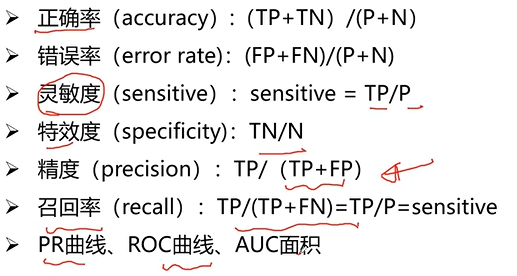
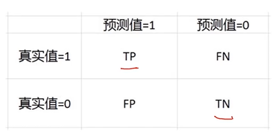

图像分类网络模型框架解读：
分类网络的基本结构：数据加载--->数据预处理/增强 || CNN网络 || N维度向量 || LossAccuracy------> 优化器

1、数据加载：
RGB数据 or BGR数据
JPEG编码后的数据
torch vision.datasets中的数据

2、数据增强：对已有的数据进行扩充

3、网络结构：可以自定义尝试

4、类别概率分布：
N维度向量对应N个类别
如何将输出的tensor转换为N个维度
softmax

-----------------------------
分类问题常用的评价指标：  
  
  
需要划分出一条阈值以判断

优化器一般使用Adam，AdamW更好
