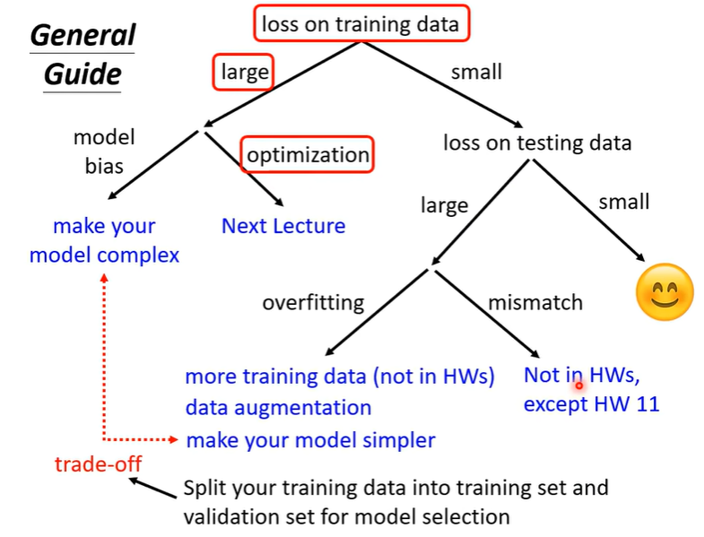
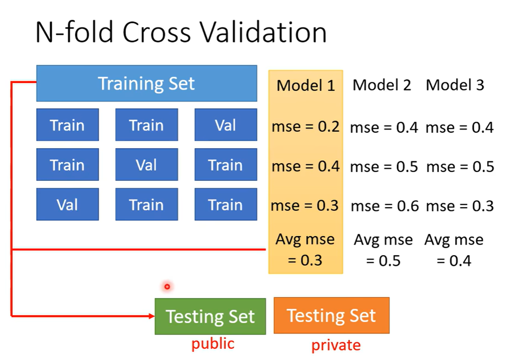

batch就是把数据按组划分，1 epoch就是将所有的组分别训练一遍

neuron 神经元

训练思路：  
  

处理过拟合的方法：  
1、减少神经元数量  
2、减少特征  
3、dropout  

对于训练效果好坏的判断：尽量不要参照private testing set  
参照training set以及 validation set最好  

n折交叉验证：  
  

训练集和测试集分布不同的话可能会导致mismatch

海森矩阵判断是local minima还是 saddle point  
    local minima在别的情况下可能是saddle point

batch：大的batch反而耗时短，但是小的batch却可以达到更好的结果

-----------------------------------
learning rate scheduling

learning rate：如果在某一方向变化很小的话可以调大尝试
如果在某一方向变化很陡峭的话可以尝试调小

学习率可以动态调整的：RMSProp方法   
    Adam：RMSProp + Momentum

warm up（黑科技）：可用于bert训练
    它会使得训练开始的时候学习率为0，01甚至更小，后期在慢慢调大比如0.1

meta learning（学习如何学习）：？？？？？？？？？？？？？？、

其实如果正确率总是100的话，反而是不利于判断generator是否在进步

有时候generator生成的图片很棒，但并不代表是有效的，可能和数据集是一模一样的，就算通过相似度来判断，也有可能只是反转的图片  

generator不仅可以文字生成图片，也可以图片生成图片 pix2pix  
gan+supervised 效果是最好的  
